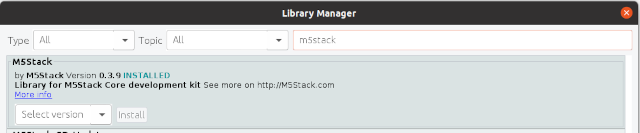

*Tiny bitcoin metrics ticker that will lasts for days on battery*

m5-bitclock is a 

## Feature Overview

* **Metrics** - block height, price, mempool size, next-block fee)
* **Power efficient** - epaper display (EPD) allows efficient use of the battery; unit lasts for days on a single charge!

## Hardware Requirements
* **[M5 Stack CoreInk Development Kit](https://shop.m5stack.com/products/m5stack-esp32-core-ink-development-kit1-54-elnk-display)** - CoreInk is an IoT prototyping device with WiFi, Bluetooth, a real-time clock, and a 1.5" electronic paper display

## Software Requirements
To flash the software to the CoreInk, you will need:

* **[Arduino IDE](https://www.arduino.cc/en/Main/Software)**

## Installation Instructions 

(Navigate [to the M5 CoreInk Quick Start Guide](https://docs.m5stack.com/en/quick_start/coreink/arduino) for detailed instructions.)

1. Install the Arduino IDE (see software requirements)
2. Configure the Arduino IDE boards manager:
   
   * In the Arduino IDE, navigate to **File Menu** -> **Preferences**
  
   * Locate the **Additional Boards Manager** setting and add the following URL to it: `https://m5stack.oss-cn-shenzhen.aliyuncs.com/resource/arduino/package_m5stack_index.json` 
   * 
  
   * Navigate to **Tools Menu** -> **Board: (XXX)** -> **Boards Manager** 
   * Search for "**`M5Stack`**" (by **M5Stack official**) and install the board configuration 
   * 
   * Set the board configuration: **Tools Menu** -> **Board: (XXX)** -> **M5Stack Arduino** -> **M5Stack-CoreInk** 
   * 
3. Install the **M5-CoreInk** Libraries:
   * **Sketch Menu** -> **Include Library** -> **Manage Libraries** 
   * Search for "**`CoreInk`**" and install the **M5-CoreInk** library (by Hades) 
   * 
   * Search for "**`M5 Stack`**" and install the **M5Stack** library (by M5) 
   * 

4. Connect the M5 CoreInk to a USB port, and configure the correct USB port:
   * **Tools Menu** -> **Port: (XXX)** -> **dev/ttyUSB0** -> **M5Stack-CoreInk**
   * 

5. Upload the software:
   * Using the menu item: **Sketch Menu** -> **Upload** 
   * 
   * or with the **Upload** button: 
   * 